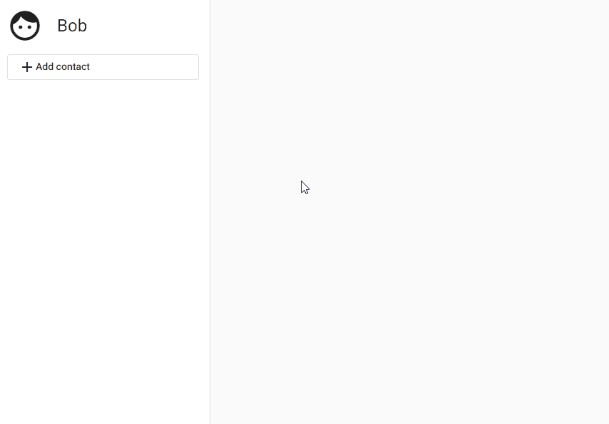
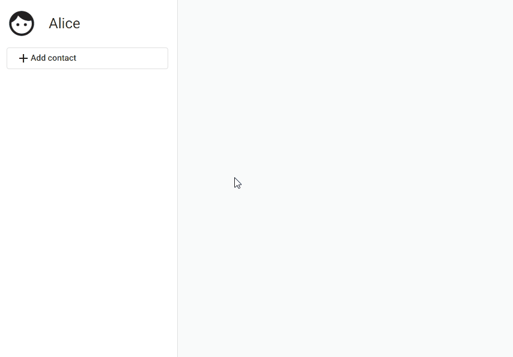
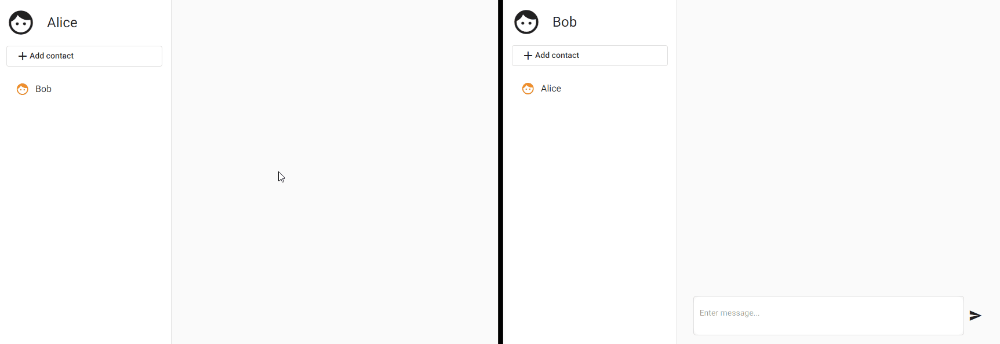
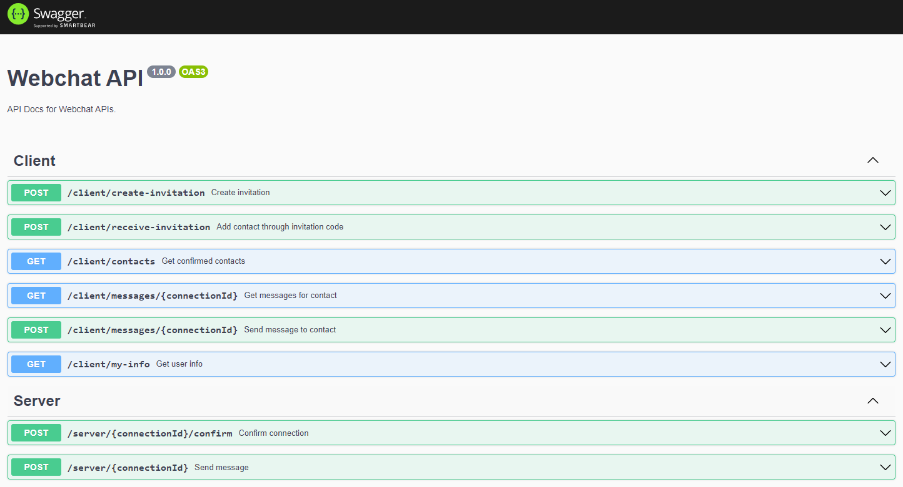

# Webchat

## Overview

Webchat is a server-to-server chat application built with TypeScript and the [Angular](https://angular.io/) and [Nest.js](https://nestjs.com/) frameworks.
This is an example fullstack application intended as a starting point for developers who are looking for something more complex than a beginner's tutorial but something less scary than a real-world open source project.

## Getting Started

### Run Demo with Docker Compose

Running this demo requires [Docker](https://docs.docker.com/get-docker/).
To get started, simply run

    ./demo.sh start

On your first run, this may take a while.
Running the demo script will set up a network of three webchat users: Alice, Bob and Eve.
Once the setup is complete, you will see a list of links which let you access Alice's, Bob's and Eve's frontend and backend.

### Example: Connect Alice and Bob

Before webchat users can exchange messages, they need to add each other as a contact.
Let us start by connecting Alice and Bob.

First, open Bob's webchat frontend.
In your browser, enter the following address:

    http://localhost:4202

Click on *Add contact*.
In the window that opens, copy the generated invitation code by clicking on the copy symbol.

Open a new browser tab or window and browse to Alice's webchat frontend:

    http://localhost:4201

Click on *Add contact* and paste Bob's invitation code.
Click on the "Add contact" button.
Bob should now appear as one of Alice's contacts.

Go back to Bob's frontend (at `http://localhost:4202`) and close the *Add contact* dialog if you have not already done so.
If Alice is not displayed as a contact, press <kbd>F5</kbd> to reload Bob's contact list.

Now that Alice and Bob are connected, they can send messages to each other.
On Alice's frontend (`http://localhost:4201`), click on Bob's name and enter a message in the message window.
Click the Send button or press <kbd>Ctrl + Enter</kbd>.
The message should then also appear in Bob's chat with Alice.

### View API Docs

The Webchat backend API is automatically created as an OpenAPI document using the [Nest.js Swagger module](https://docs.nestjs.com/openapi/introduction).
To view the API docs, browse to

    http://localhost:3001/docs

### Stop Demo

Once you are finished, stop the demo by running

    ./demo.sh stop

This will stop and remove all webchat Docker containers and networks.
